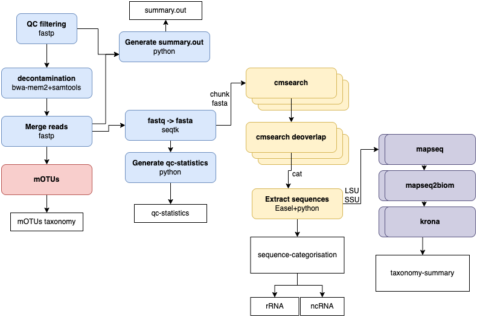

# Taxonomic profiling pipeline

Raw reads mOTUs and taxonomic classification pipeline.

<p align="center">
    
</p>

The pipeline is implemented in [Nextflow](https://www.nextflow.io/) and needs as second dependency either [Docker](https://docs.docker.com/v17.09/engine/installation/linux/docker-ce/ubuntu/#install-docker-ce) or [Singularity](https://sylabs.io/guides/3.0/user-guide/quick_start.html).
All databases are automatically downloaded by Nextflow.

## Pipeline summary

WIP - brief description of the pipeline.

## Quick Start

1. Install [Nextflow](https://www.nextflow.io/)

2. Install any of [Docker](https://docs.docker.com/v17.09/engine/installation/linux/docker-ce/ubuntu/#install-docker-ce)or  [Singularity](https://sylabs.io/guides/3.0/user-guide/quick_start.html).

3. Download the pipeline and test it on a minimal dataset with a single command:

    ```bash
    nextflow run EBI-Metagenomics/motus_pipeline \
    -profile <choose profile> \
    --mode <single/paired> \
    --reads <path to folder with fastq files> \
    --name <fastq filename>
    ```

### Run examples

Add your own profile to nextflow.config file including all inputs

#### Basic run

```bash
nextflow run EBI-Metagenomics/motus_pipeline \
-profile <choose profile> \
--mode <single/paired> \
--reads <path to folder with fastq files> \
--name <fastq filename>
```

#### Local Single End run

The reads location: my_reads/raw/test.fastq.gz

```bash
nextflow run EBI-Metagenomics/motus_pipeline \
-profile local \
--mode single \
--reads my_reads/raw \
--name test
```
#### Local Paired Ends run

The reads location:
- my_reads/raw/test_1.fastq.gz
- my_reads/raw/test_2.fastq.gz

```bash
nextflow run EBI-Metagenomics/motus_pipeline \
-profile local \
--mode paired \
--reads my_reads/raw \
--name test
```

## Development

Install development tools (including pre-commit hooks to run Black code formatting).

```bash
pip install -r requirements-dev.txt
pre-commit install
```

### Code style

Use Black, this tool is configured if you install the pre-commit tools as above.

To manually run them: black .

## Testing

The pipeline unit test are executed using [nf-test](https://github.com/askimed/nf-test).

To run the nextflow unit tests the databases have to downloaded manually, we are working to improve this.

```bash
nf-test test tests/*
```
